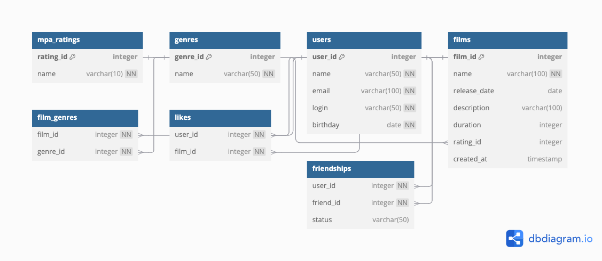

## Схема базы данных

Ниже представлена схема базы данных:

 <!-- Путь к изображению должен быть относительным или абсолютным в зависимости от вашего проекта -->

### Описание схемы базы данных

Схема базы данных содержит таблицы для хранения пользователей, фильмов, жанров, лайков и дружбы. Основные связи включают:

- **Связь многие ко многим** между фильмами и жанрами через таблицу `film_genres`.
- **Связь** между пользователями и лайками фильмов через таблицу `likes`.
- **Связь пользователей** друг с другом через таблицу `friendships` для хранения дружеских отношений.

### Таблицы

- **mpa_ratings**
  - `rating_id INT PRIMARY KEY` - уникальный идентификатор рейтинга.
  - `name VARCHAR(10) NOT NULL` - название рейтинга.

- **genres**
  - `genre_id INT AUTO_INCREMENT PRIMARY KEY` - уникальный идентификатор жанра.
  - `name VARCHAR(50) NOT NULL UNIQUE` - название жанра.

- **users**
  - `user_id INT AUTO_INCREMENT PRIMARY KEY` - уникальный идентификатор пользователя.
  - `name VARCHAR(50) NOT NULL` - имя пользователя.
  - `email VARCHAR(100) NOT NULL UNIQUE` - электронная почта пользователя.
  - `login VARCHAR(50) NOT NULL UNIQUE` - логин пользователя.
  - `birthday DATE NOT NULL` - дата рождения пользователя.

- **films**
  - `film_id INT AUTO_INCREMENT PRIMARY KEY` - уникальный идентификатор фильма.
  - `name VARCHAR(100) NOT NULL` - название фильма.
  - `release_date DATE` - дата выпуска фильма.
  - `description VARCHAR(100)` - описание фильма.
  - `duration INT` - продолжительность фильма в минутах.
  - `rating_id INT` - идентификатор рейтинга (внешний ключ на `mpa_ratings`).

- **film_genres**
  - `film_id INT NOT NULL` - идентификатор фильма (внешний ключ на `films`).
  - `genre_id INT NOT NULL` - идентификатор жанра (внешний ключ на `genres`).
  - PRIMARY KEY (film_id, genre_id) - составной первичный ключ.

- **likes**
  - `user_id INT NOT NULL` - идентификатор пользователя (внешний ключ на `users`).
  - `film_id INT NOT NULL` - идентификатор фильма (внешний ключ на `films`).
  - PRIMARY KEY (user_id, film_id) - составной первичный ключ.

- **friendships**
  - `user_id INT NOT NULL` - идентификатор пользователя (внешний ключ на `users`).
  - `friend_id INT NOT NULL` - идентификатор друга (внешний ключ на `users`).
  - `status VARCHAR(50)` - статус дружбы.
  - PRIMARY KEY (user_id, friend_id) - составной первичный ключ.

### Примеры запросов

- **Получение всех фильмов**:
  ```sql
  SELECT * FROM films;

- **Получение всех фильмов**:
  ```sql
  SELECT g.name
  FROM genres g
  JOIN film_genres fg ON g.genre_id = fg.genre_id
  WHERE fg.film_id = :film_id;

- **Получение списка общих друзей между двумя пользователями:**:
  ```sql
  SELECT u.*
  FROM users u
  JOIN friendships f1 ON u.user_id = f1.friend_id
  JOIN friendships f2 ON u.user_id = f2.friend_id
  WHERE f1.user_id = :user1_id AND f2.user_id = :user2_id;


